## <mark>**Story of Kubernetes (K8s)**</mark>

### **1. Monolithic Systems (Previous Generation)**

- Let’s imagine we are building an **e-commerce system**.

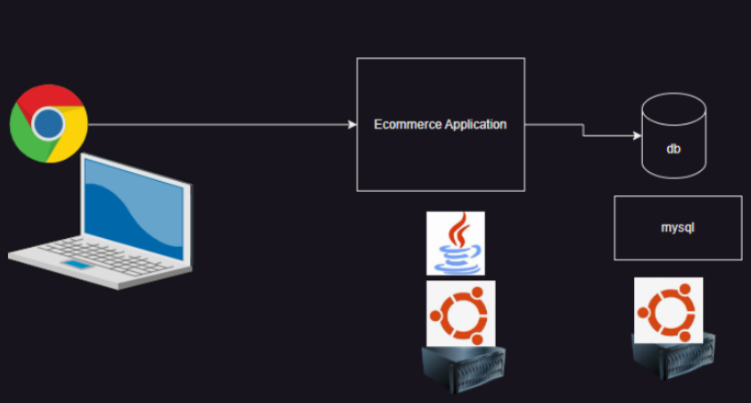

- The system consists of multiple modules, such as:
  - **User Registration and Management**
  - **Administration**
  - **Catalog**
  - **Warehousing**
  - **Logistics**
  - **Cart**
  - **Payment**
  - **Notifications**

#### **Challenges with Monolithic Systems**

1. **Scaling Issues:**
   - During peak times like a seasonal sale, a large number of users access the system simultaneously.
   - To handle this, we need to scale up servers hosting the monolithic application.

   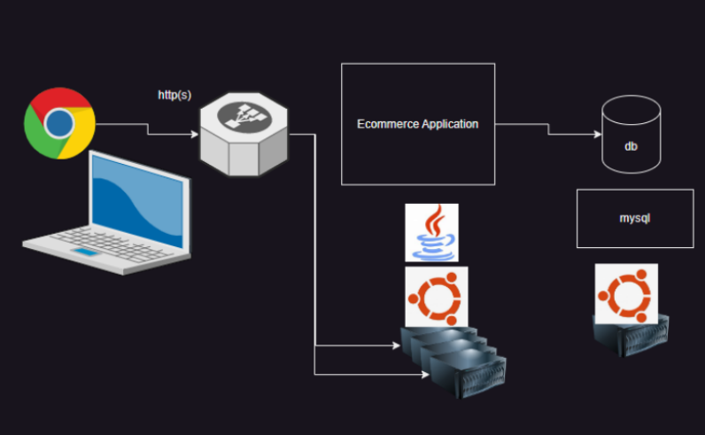

2. **Application Updates:**
   - For **zero downtime updates**, additional servers are required.
   - Rollout involves updating each server one by one while keeping at least one running.
   - **Rollback** becomes complex if issues arise in the new version, requiring expertise.

---

### **2. Transition to Microservices**

- Applications are **decomposed into smaller, independently runnable services**. 
  - Each service manages a specific module (e.g., user management, payment, notifications).
  - Services can be updated, deployed, and scaled independently.

#### <mark>**How Kubernetes (K8s) Emerged (origin)**</mark>

- Google has a long history of running **containers** internally.
- They built orchestration systems to manage containers effectively:
  - **OMEGA**
  - **BORG**

- With the release of Docker, containers became widely adopted. 
- Leveraging their experience, Google developed an orchestration system called **Kubernetes**, written in **Go**, and made it open source.

#### **What is Kubernetes?**
- Kubernetes (K8s) is an **open-source system** that automates:
  - Deployment
  - Scaling
  - Management of containerized applications
    - Key Aspects of Kubernetes Management of Containerized Applications:

| **Aspect**                     | **Description**                                                                                                                                                           |
|--------------------------------|---------------------------------------------------------------------------------------------------------------------------------------------------------------------------|
| **Container Lifecycle Management** | Kubernetes ensures containers are running as expected by continuously monitoring their health.                                                                           |
|                                | Automatically restarts containers that fail or become unresponsive.                                                                                                     |
|                                | Deletes containers that are no longer needed based on workload changes.                                                                                                 |
| **Self-Healing**               | Detects and replaces failed nodes or containers.                                                                                                                        |
|                                | Reschedules containers on healthy nodes in the cluster.                                                                                                                |
| **Configuration Management**    | Uses declarative configurations (YAML/JSON files) to define the desired application state.                                                                              |
|                                | Allows easy updates by simply modifying the configuration files.                                                                                                       |
|                                | Tracks and enforces the desired state across the cluster.                                                                                                              |
| **Resource Optimization**       | Distributes workloads evenly across nodes using resource requests and limits.                                                                                            |
|                                | Ensures optimal utilization of CPU and memory resources.                                                                                                               |
|                                | Supports scaling of containers up or down based on real-time resource usage or custom metrics.                                                                          |
| **Networking and Load Balancing** | Automatically creates and manages internal networking for communication between containers.                                                                             |
|                                | Provides built-in load balancing to distribute external traffic evenly among available containers.                                                                        |
| **Rolling Updates and Rollbacks** | Supports rolling updates to deploy new versions of applications without downtime.                                                                                       |
|                                | Allows rollbacks to previous stable versions if issues arise.                                                                                                          |
| **Logging and Monitoring**      | Integrates with logging and monitoring tools (e.g., Prometheus, Grafana) to track container performance and health.                                                     |
|                                | Provides detailed insights into container behavior and cluster operations.                                                                                              |

K8s focuses on **running containers in production scenarios**.

#### **Alternatives to Kubernetes:**
- **Docker Swarm**
- **Apache Mesos**
- **AWS ECS (Elastic Container Service)**

---
---

## <mark>**Kubernetes Architecture**</mark>

- A Kubernetes cluster is a **combination of multiple nodes**, categorized into:
  1. **Master Node**:
     - Manages the cluster.
     - Handles scheduling, orchestration, and management.
  2. **Worker Nodes**:
     - Run the application workloads.
     - Containers are hosted and executed here.

[phippy and friends](https://www.cncf.io/phippy/the-childrens-illustrated-guide-to-kubernetes/)

[Phippy Goes to the Zoo](https://www.cncf.io/phippy/phippy-goes-to-the-zoo-book/)

**<mark>For a fun introduction to microservices, check out the</mark>** [Kubernetes Comic Book by Google](https://cloud.google.com/kubernetes-engine/kubernetes-comic).

### **Introduction-Kubernetes**

#### **Overview of Containers**


| **Question or Concern about containers**                                             | **Solution through Kubernetes**                                                                                                                                                                                                                      |
|---------------------------------------------------------------------|----------------------------------------------------------------------------------------------------------------------------------------------------------------------------------------------------------------------------------------------------------|
| **Are containers production-ready?**                                | Kubernetes automates the deployment, scaling, and management of containerized applications, ensuring they are robust and reliable for production environments.                                                                                         |
| **What happens if a container or Docker host goes down?**          | Kubernetes provides self-healing capabilities by automatically restarting failed containers, rescheduling them on healthy nodes, and redistributing workloads to maintain application availability.                                                       |
| **How to make containers available 24/7?**                         | Kubernetes supports high availability through automated failover and load balancing, ensuring that applications remain accessible even during node failures or maintenance.                                                                              |
| **How to handle loads during peak times?**                          | Kubernetes enables horizontal scaling by automatically adding or removing containers based on real-time resource usage or custom metrics, allowing applications to handle increased traffic efficiently.                                                  |
| **How to replace containers without downtime?**                     | Kubernetes supports rolling updates, allowing new versions of applications to be deployed gradually without interrupting service. If issues arise, it can also roll back to previous stable versions seamlessly.                                          |
| **How to monitor containers?**                                      | Kubernetes integrates with various monitoring tools (e.g., Prometheus, Grafana) to provide insights into container performance and health, enabling proactive management of applications.                                                                |

<mark>**Kubernetes Provides** </mark>

| **Feature**                    | **Description**                                                                                                   |
|---------------------------------|-------------------------------------------------------------------------------------------------------------------|
| **Service Discovery & Load Balancing** | Automatically assigns DNS names to services and balances traffic to containers within those services.            |
| **Storage Orchestration**       | Manages storage for containers, including dynamic provisioning, persistent storage, and volume attachments.        |
| **Automated Rollouts and Rollbacks** | Enables rolling updates to applications with zero downtime and easy rollback to previous stable versions if needed. |
| **Automated Bin Packing**       | Places containers based on resource requirements and constraints, optimizing resource usage across the cluster.     |
| **Self-Healing**                | Detects and replaces failed containers or nodes to maintain the desired state of the system.                       |
| **Secret & Configuration Management** | Manages sensitive data (e.g., passwords, API keys) and configuration settings securely, separate from application code. |
| **Horizontal Scaling**          | Automatically adjusts the number of running containers (pods) based on real-time resource usage or custom metrics.  |
| **Cluster Management**          | Manages the lifecycle of the cluster, including scaling up or down and maintaining healthy nodes.                   |
| **Multi-Tenancy**               | Uses **namespaces** to logically partition resources and manage multiple teams or projects within the same cluster.  |
| **Monitoring and Logging**      | Integrates with tools like Prometheus and Grafana for performance tracking and cluster insights.                    |
| **Custom Resource Definitions (CRDs)** | Extends Kubernetes' functionality by allowing you to define and manage custom resources.                        |
| **Network Policies**            | Defines rules for controlling traffic flow between pods or services, ensuring secure communication.                 |


* We express our **desired state in yaml or imperative command** and **use a client (ex: kubectl) to communicate with k8s** and k8s does the rest

### **Kubernetes Master and Node Components - Explanation**

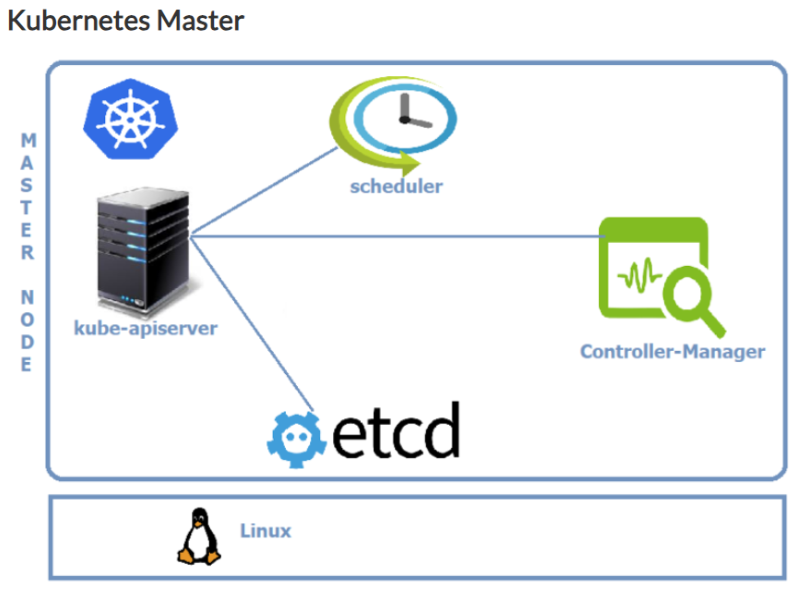

* Kubernetes master runs on Linux nodes

#### **Master Components**

* **kube-api Server**
  - The **kube-api Server** is central to Kubernetes, acting as the communication hub for all components within the system.  
  - It serves as the **frontend of the Kubernetes control plane** and is responsible for handling requests.  
  - The **kube-api Server exposes a REST API**, enabling interactions with the cluster.  
  - Users and tools interact with this component primarily through the `kubectl` command-line tool, using **YAML manifests** to define the desired cluster state.

* **etcd**
  * Stores the entire configuration and state of the cluster. A backup of Kubernetes is essentially a backup of etcd.
  * etcd is consistent and highly available distributed key-value store.

- **Scheduler**  
  - The **Kubernetes Scheduler** is responsible for watching for newly created tasks (e.g., pods) that have no assigned node.  
  - It evaluates the resource requirements of these tasks and assigns them to **healthy nodes** in the cluster based on various factors such as resource availability, constraints, and policies.  
  - The scheduler ensures optimal utilization of cluster resources while maintaining the desired state.

- **Controller-Manager**  
  - The **Controller-Manager** is responsible for maintaining the desired states specified in the manifest files.  
  - Although it appears as a single component, it contains multiple controllers, each with a specific function:  
    - **Node Controller**: Monitors nodes in the cluster and takes action when a node goes down.  
    - **Replication Controller**: Ensures the correct number of pods are running for each replication controller object.  
    - **Endpoints Controller**: Populates the **Endpoints** object, which is used to link services with their corresponding pods.

- **Cloud-Controller-manager**
  - If you run the Kubernetes on a supported **cloud platform** such as AWS, Azure or Google, your **control plane runs the Cloud-Controller-Manager**.
  - It is responsible for underlying cloud specific controllers.

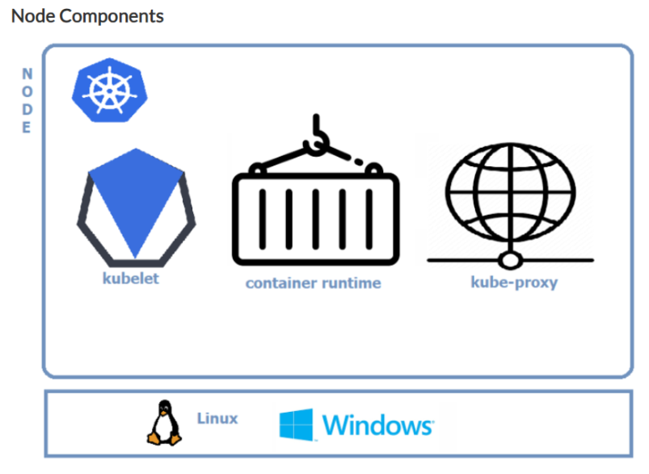

- **kubelet**  
  - The **kubelet** is an agent that runs on each node in the cluster.  
  - It **watches for instructions from the API Server** and executes tasks (e.g., managing pods and containers) assigned to the node.  
  - If it cannot run the assigned task, it reports back to the master, allowing the control plane to decide the next steps.  
  - The kubelet is also responsible for the **node registration process**, ensuring the node is part of the cluster and ready to receive workloads.

- **Container Runtime**  
  - The **Container Runtime** is software responsible for running containers on each node in the Kubernetes cluster.  
  - It pulls container images, runs containers, and manages their lifecycle.  
  - Some commonly used container runtimes include:
    - **Docker**, **containerd**, **CRI-O**, **rktlet**

- **kube-proxy**  
  - The **kube-proxy** maintains network rules on each node in the cluster.  
  - It is responsible for **networking on nodes**, handling network traffic between pods, services, and external clients.  
  - kube-proxy ensures that traffic is properly routed, enabling communication within the cluster and between services.

- **Cluster DNS**  
  - Every **Kubernetes Cluster** includes an internal DNS service for name resolution within the cluster.  
  - The DNS service has a **static IP address** that is hardcoded into every pod, ensuring that all pods know how to find the DNS server.  
  - **Services**, **StatefulSets**, and **Pods** are registered with the **Cluster DNS**, allowing for seamless internal name resolution.  
  - The **Cluster DNS** is based on **CoreDNS**, which is the default DNS provider for Kubernetes.

---
---
Here are the refined notes for **Kubernetes Installation (Self-hosted)**:

---

### <mark>**K8s Installation (Self-hosted)**</mark>

* Refer **k8s_Selfhosted_setup.md** for k8s Self-Hosted Setup

---
---

## **Kubernetes Major Workloads**

### <mark>**Pod**</mark>

- [Official Docs](https://kubernetes.io/docs/concepts/workloads/pods/)
- **Pods** can contain one or more closely associated containers.
- Each **Pod** gets a unique IP address, which is shared among the containers inside it.
- Pods can contain two types of containers:
  - <mark>**Init containers**</mark>: These containers are created in a sequence and run to completion. They are typically used for precondition checks before the main containers run.
    - Refer **Init_containers.md** for more details.
  - <mark>**Containers**</mark>: These are the main application containers, which are created in parallel and are expected to run continuously.
- The **desired state of a Pod** is defined by the containers running inside it. If any container fails, Kubernetes will continuously attempt to restart it to maintain the desired state.
  - Desired State of a Pod:
    - The number and type of containers that should be running.
    - The images the containers should use.
    - The environment variables, volumes, Ports, resource requests, and limits and other settings[configurations for health checks, liveness/readiness probes, security settings (like user privileges or service accounts), and any other container-level or Pod-level settings.]
- There is a special type of container called **ephemeral containers**
  - <mark>**ephemeral containers**</mark> are a special type of container in Kubernetes that are intended primarily for debugging purposes. Unlike regular containers in a Pod, ephemeral containers do not have a fixed lifecycle and are added to a running Pod for temporary use. They can be used to help troubleshoot or debug issues in a Pod that is already running.

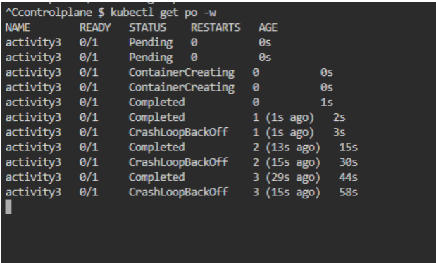

---

## **components**
### <mark>**NameSpaces**</mark>
* Namespaces allow to split-up resources into different groups.
* Resource names should be unique in a namespace
* We can use namespaces to create multiple environments like dev, staging and production etc
* Kubernetes will always list the resources from default namespace unless we provide exclusively from which namespace we need information from.
-   Resources are classified into two scopes
    -   Namespace scoped resources:
        -   Namespace true indicates namespace scoped resources
    -   Cluster scoped resources
        -   Namespaced false indicates cluster scoped resources

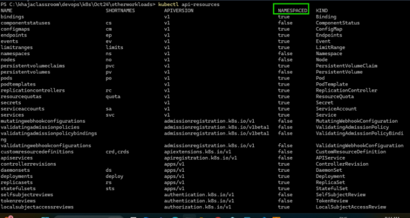

```bash
kubectl api-resources

# List Namespaces
kubectl get ns 

# Craete Namespace
kubectl create namespace <namespace-name>
kubectl create namespace dev1

# List Namespaces
kubectl get ns 

# Deploy All k8s Objects
kubectl apply -f kube-manifests/ -n dev1

# List Services
kubectl get svc -n dev1

# Delete namespaces dev1 & dev2
kubectl delete ns dev1
```

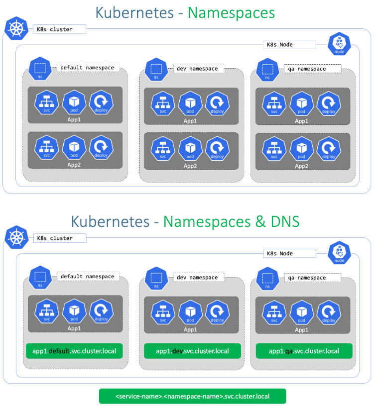

---
---

## **Controllers**

### <mark>**ReplicaSet**</mark>

- [Official Docs](https://kubernetes.io/docs/concepts/workloads/controllers/replicaset/)
- ReplicaSets are used to ensure that a specified number of identical Pods are running at any given time.
- If any Pod fails or is deleted, the ReplicaSet will create a new one to maintain the desired number of replicas.
- Key Features of ReplicaSet:
  - Maintain Desired Number of Pods
  - Self-Healing
  - Scaling
  - Label Selector

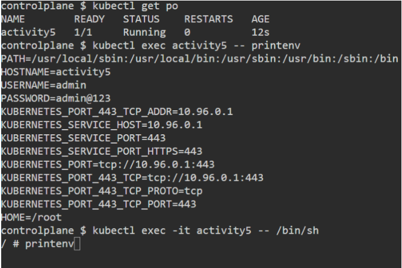

### <mark>**Deployment**</mark>

-   Deployments create replica sets, replicasets create pods which in turn runs the containers
-   Deployments are suitable for stateless applications
-   Deployments come with two strategies
    -   Recreate
    -   RollingUpdates (Default)
-   In Rolling updates
    -   We can rollout New versions
    -   undo rollout (rollbacks)
- [Official Docs](https://kubernetes.io/docs/concepts/workloads/controllers/deployment/)
- For deployment **to record the change cause** lets use the **annotation** [Refer here](https://kubernetes.io/docs/reference/labels-annotations-taints/#change-cause)
- To find the **deployment status** we use **kubeclt rollout**
- To deploy the new version change the tag and change cause annotation

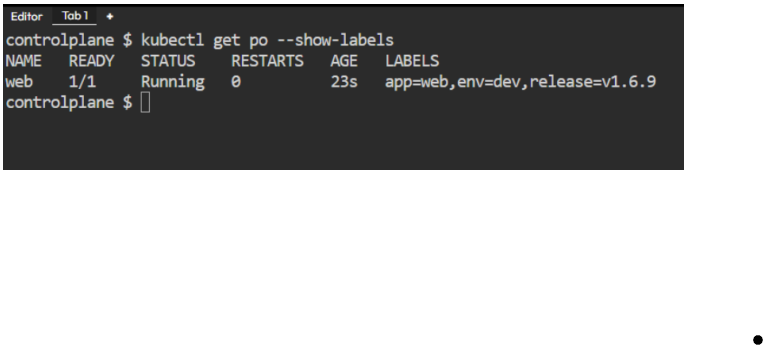

- A **Deployment** manages ReplicaSets and enables **scaling of applications**, as well as **rolling updates** and **rollbacks** through **versioning**.
---

### <mark>**DaemonSet**</mark>  

- [Official Docs](https://kubernetes.io/docs/concepts/workloads/controllers/daemonset/)  
 
-   Daemonsets are used to run a pod on each node or selected nodes
-   They are useful for running agent like softwares in container
-   Daemonset support rolling updates like deployments
-   [Refer Here](https://kubernetes.io/docs/concepts/workloads/controllers/daemonset/) for offical docs

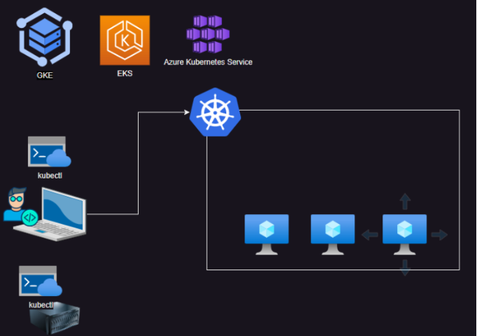

- **Use Cases**:  
  - Running background processes like log collection (e.g., Fluentd or Logstash).  
  - Monitoring agents (e.g., Prometheus Node Exporter).  
  - Networking plugins (e.g., Flannel or Calico).  
- **Independent of Desired State Scaling**:  
  Unlike ReplicaSets or Deployments, the number of Pods is tied to the number of nodes rather than a fixed desired state.

```yaml
---
apiVersion: apps/v1
kind: DaemonSet
metadata:
  name: hello-ds
spec:
  minReadySeconds: 5
  selector:
    matchLabels:
      app: agent
  template:
    metadata:
      labels:
        app: agent
    spec:
      containers:
        - name: logagent
          image: fluent/fluentd:edge-debian
          resources:
            requests:
              memory: 64Mi
              cpu: 200m
            limits:
              memory: 128Mi
              cpu: 300m
          ports:
            - containerPort: 9880
              name: fluentd
```
---

### <mark>**Jobs and CronJobs**</mark>

-   [Refer Here](https://kubernetes.io/docs/concepts/workloads/controllers/cron-jobs/) for cronjob demo
-   Lets write a cronjob which runs every working day at 11:30 PM  

```yaml
---
apiVersion: batch/v1
kind: CronJob
metadata:
  name: transaction-cron
spec:                           # cron-job spec
  schedule: "30 23 * * 1-5"
  jobTemplate:
    metadata:
      labels:
        app: tx-checker
    spec:                       # Job spec
      template:
        metadata:
          labels:
            app: tx-checker
        spec:                   # Pod spec
          containers:
            - name: tx-checker
              image: alpine
              args: # replace with script that does the job
                - sleep
                - 30s
          restartPolicy: OnFailure
```
---


### <mark>**StatefulSet**</mark>  

- [Official Docs](https://kubernetes.io/docs/concepts/workloads/controllers/statefulset/)  

- StatefulSets are used to manage stateful applications that require stable network identities and persistent storage.

### **Key Features**  
1. **Unique Pod Identity**:  
   Each Pod in a StatefulSet gets a predictable name in the format `statefulset-name-index` (e.g., `my-app-0`, `my-app-1`).  
2. **Stable Network Identity**:  
   Each Pod maintains a unique and stable network hostname, even after being rescheduled.  
3. **Ordered Deployment and Scaling**:  
   Pods are created or terminated in a sequential order, ensuring controlled deployment and updates.  
4. **Persistent Storage**:  
   Each Pod can have its own PersistentVolume, which is retained even after the Pod is deleted.  
5. **Rolling Updates**:  
   StatefulSets support updates to Pods, maintaining order and state consistency.

### **Use Cases**  
- **Databases**: PostgreSQL, MySQL, MongoDB.  
- **Message Queues**: Kafka, RabbitMQ.  
- **Distributed Systems**: Elasticsearch, Cassandra.  
- Any application requiring stable storage or networking.

### **Lifecycle Management**  
1. **Scaling**:  
   Pods are scaled one at a time, respecting their order (e.g., `my-app-0` must be running before `my-app-1` starts).  
2. **Updates**:  
   Pods are updated in sequence to minimize disruption.  
3. **Deletion**:  
   Pods are deleted in reverse order to maintain state integrity.

### **How StatefulSets Differ from ReplicaSets**  
| Feature                | StatefulSet                          | ReplicaSet                 |
|------------------------|--------------------------------------|---------------------------|
| Pod Identity           | Unique, stable hostname             | Generic, ephemeral hostname|
| Storage                | Persistent, per-Pod volumes         | Shared or none            |
| Deployment Order       | Sequential                          | Parallel                  |
| Use Cases              | Stateful apps, databases, queues    | Stateless apps            |

### **Benefits**  
- Ensures data consistency and stable connections across cluster nodes.  

---

## <mark>**Label**</mark>

- Labels are key-value pairs attached to Kubernetes objects.
- Kubernetes uses labels to organize and query resources efficiently.

---

## <mark>**Service**</mark>

  A **Service** is a Kubernetes resource that provides a stable network endpoint to a group of dynamically changing Pods.

- **Purpose**:  
  - It abstracts the underlying Pods to provide a consistent way to access them.  
  - Ensures reliable communication between components, even if Pods are recreated or scaled.

- **Key Features**:  
  1. **Stable Network Identity**:  
     - Services assign stable IP addresses and DNS names, ensuring consistent access.  
  2. **Dynamic Pod Management**:  
     - Automatically adapts to changes in the Pods (e.g., scaling or replacements).  
  3. **Selectors**:  
     - Services use **label selectors** to identify the set of Pods they manage.  
  4. **Load Balancing**:  
     - Distributes traffic evenly across the associated Pods.

- **Types of Services**:  
  1. **ClusterIP**:  
     - Default type; exposes the Service internally within the cluster.  
  2. **NodePort**:  
     - Exposes the Service on a static port on each node.  
  3. **LoadBalancer**:  
     - Creates an external load balancer to expose the Service.  
  4. **ExternalName**:  
     - Maps a Service to an external DNS name.

- **Use Case**:  
  - Frontend application accessing a backend service through a consistent endpoint, regardless of backend Pod changes.

---
---

## **Kubernetes API Server and Clients**

### **Overview**  
- The **Kubernetes API Server** acts as the central management component, exposing APIs for all cluster operations.  
- **kubectl** is the primary CLI tool for interacting with the API Server.

---

### <mark>**kubectl**</mark> 
- Uses the `~/.kube/config` file to connect to the API Server.  
  - **References**:  
    - [Kubectl Reference Docs](https://kubernetes.io/docs/reference/kubectl/)  
    - [Kubectl Quick Reference Cheatsheet](https://kubernetes.io/docs/reference/kubectl/quick-reference/)  

- **Resource Creation Approaches**:  
  1. **Imperative**:  
     - Directly execute commands to create or modify resources.  
     - Example:  
       ```bash
       kubectl run nginx --image=nginx
       ```  
     - Best for ad-hoc or one-time tasks.  

  2. **Declarative**:  
     - Write YAML manifests defining the desired state and apply them.  
     - Example:  
       ```bash
       kubectl apply -f deployment.yaml
       ```  
     - Ideal for automation, repeatability, and version control.  

     - <mark>Refer yaml_syntax.md for yaml syntax</mark> 
---

### ** Kubernetes API Features**  
- **Client Libraries**:  
  - Kubernetes offers libraries in various programming languages (e.g., Python, Go).  
  - Reference: [Kubernetes Client Libraries](https://kubernetes.io/docs/reference/using-api/client-libraries/)  

- **API Versioning**:  
  - Ensures backward compatibility and smooth transitions across Kubernetes versions.  
  - API version format:  
    - `APIGROUP/version` (e.g., `apps/v1`) for non-core APIs.  
    - `version` (e.g., `v1`) for core APIs.  
  - Reference: [API Versioning Guide](https://kubernetes.io/docs/reference/using-api/#api-versioning)  

- **API Groups**:  
  - Organize related resources. Common groups include:  
    - `core`: Core Kubernetes objects (e.g., Pods, Services).  
    - `apps`: Workloads (e.g., Deployments, StatefulSets).  
    - `batch`: Batch jobs and CronJobs.  

---

### <mark>**Manifest Structure**</mark>
- A typical YAML manifest includes:  
  1. `apiVersion`: Specifies the API version (e.g., `apps/v1`).  
  2. `kind`: Defines the resource type (e.g., Pod, Service).  
  3. `metadata`: Holds information like name, labels, and annotations.  
  4. `spec`: Describes the desired state of the resource.  

- Upon execution, Kubernetes adds a `status` field to the resource, reflecting its current state.

---

### **Commands**  
- Check cluster configuration:  
  ```bash
  kubectl config view
  ```
- Get resources:  
  ```bash
  kubectl get <resource>
  ```
- Describe a resource:  
  ```bash
  kubectl describe <resource> <name>
  ```
---
---

## <mark>**Writing Kubernetes Manifests**</mark>

### **Key Concepts**
- Kubernetes manifests define resources in YAML format, strictly structured according to [API References](https://kubernetes.io/docs/reference/).  
- For detailed API reference of version 1.31, check [here](https://kubernetes.io/docs/reference/generated/kubernetes-api/v1.31/).

---

### **Activity 1: Create a Basic Pod**
- **Pod Name**: `hello-pod`  
- **Container**: nginx with version `1.27`.

**Manifest Example**:  
```yaml
apiVersion: v1
kind: Pod
metadata:
  name: hello-pod
spec:
  containers:
  - name: web
    image: nginx:1.27
```

**Commands**:  
1. Create the Pod:  
   ```bash
   kubectl apply -f <filename.yaml>
   ```
2. View Pod Information:  
   ```bash
   kubectl get pods <pod-name>
   kubectl get pods <pod-name> -o wide
   kubectl describe pods <pod-name>
   kubectl get pods <pod-name> -o yaml
   ```
3. Watch Pod Status in Real-Time:  
   ```bash
   kubectl get pods -w
   ```

---

### **Activity 2: Pod with Two Containers**
- **Pod Name**: `activity-2`  
- **Containers**:  
  1. nginx: `1.27`  
  2. alpine with command `sleep 1d`.

**Manifest Example**:  
```yaml
apiVersion: v1
kind: Pod
metadata:
  name: activity-2
spec:
  containers:
  - name: web
    image: nginx:1.27
  - name: sidecar
    image: alpine
    args: ["sleep", "1d"]
```

---

### **Activity 3: Pod with a Container that Exits**
- Kubernetes will restart Pods in a **CrashLoopBackOff** state due to its self-healing feature.  

- Example: Pod with an alpine container executing `sleep 10s`.

### **Init Containers**
- **Purpose**: Perform preconditions or preparatory steps before the main container starts. 
- Init containers run sequentially; each must complete successfully before the next one starts.

**Activity 4: Pod with Init Containers**  
- **Pod Spec**:  
  - Containers: nginx and alpine (`sleep 1d`).  
  - Init Containers:  
    - init1 (alpine, `sleep 10s`)  
    - init2 (alpine, `sleep 10s`).  

**Manifest Example**:  
```yaml
apiVersion: v1
kind: Pod
metadata:
  name: activity-4
spec:
  initContainers:
  - name: init1
    image: alpine
    args: ["sleep", "10s"]
  - name: init2
    image: alpine
    args: ["sleep", "10s"]
  containers:
  - name: web
    image: nginx:1.27
  - name: sidecar
    image: alpine
    args: ["sleep", "1d"]
```

---

### **Activity 5: Pod with Environment Variables**
- **Pod Name**: `env-pod`  
- **Container**: alpine (`sleep 1d`)  
- **Environment Variables**:  
  - `USERNAME=admin`  
  - `PASSWORD=admin@123`.  

**Manifest Example**:  
```yaml
apiVersion: v1
kind: Pod
metadata:
  name: env-pod
spec:
  containers:
  - name: test
    image: alpine
    args: ["sleep", "1d"]
    env:
    - name: USERNAME
      value: "admin"
    - name: PASSWORD
      value: "admin@123"
```

Equivalent Docker Command:  
```bash
docker run -e "USERNAME=admin" -e "PASSWORD=admin@123" alpine sleep 1d
```

Getting Environment Variables
```bash
kubectl exec env-pod -c test -- env
# or
kubectl exec -it env-pod -- /bin/sh
printenv # Once Inside the Container
```
---

### **Adding Labels to Pods**
- Labels are key-value pairs used to categorize and organize Kubernetes objects.

**Activity**:  
- Pod Name: `web`  
- Labels:  
  - `env: dev`  
  - `app: web`  
  - `release: v1.6.9`.  

**Manifest Example**:  
```yaml
apiVersion: v1
kind: Pod
metadata:
  name: web
  labels:
    env: dev
    app: web
    release: v1.6.9
spec:
  containers:
  - name: web
    image: nginx:1.27
```


---

### **Label Selectors**
- Label selectors enable efficient resource querying based on labels.  
- Reference: [Kubernetes Label Selectors](https://kubernetes.io/docs/concepts/overview/working-with-objects/labels/#label-selectors).

---
---

## <mark>**Managed kubernetes cluster**</mark>

Managed Kubernetes clusters simplify operating Kubernetes by outsourcing the management of the control plane to cloud providers. 
#### key points:

1. **Offered by Cloud Providers**:
   - Services like AWS EKS, Azure AKS, Google GKE, and others provide managed Kubernetes clusters.
   - These services reduce the operational burden of managing Kubernetes infrastructure.

2. **Managed Control Plane**:
   - The control plane (API server, scheduler, controller manager, etc.) is maintained by the cloud provider.
   - Users only manage worker nodes and the workloads running on them.
   - This setup provides a consistent, scalable environment without the need to handle complex installations or updates.

3. **Black Box Nature**:
   - The control plane is treated as a "black box"; users don’t have direct access to its internals.
   - This abstraction allows teams to focus on application deployment and management rather than Kubernetes internals.

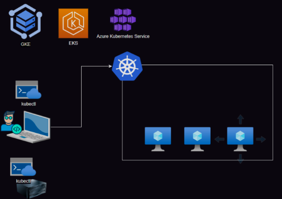
---


### <mark>**Azure Kubernetes Services (AKS)**</mark>

* AKS is managed k8s offered by Azure [Refer Here](https://learn.microsoft.com/en-us/azure/aks/what-is-aks)
* Lets setup AKS Cluster
  * Pre-reqs:
    * Azure CLI is installed and configured
* [Refer Here](https://learn.microsoft.com/en-us/azure/aks/learn/quick-kubernetes-deploy-cli) for steps
* **Azure CLI installation Script**(userdata) on a Debian-based Linux distribution:

```bash
# Update System Package Index
sudo apt-get update
# Install Required Packages
sudo apt-get install apt-transport-https ca-certificates curl gnupg lsb-release -y
# Prepare for the Azure CLI Repository
sudo mkdir -p /etc/apt/keyrings
# Add Microsoft’s GPG Key
curl -sLS https://packages.microsoft.com/keys/microsoft.asc |
  gpg --dearmor | sudo tee /etc/apt/keyrings/microsoft.gpg > /dev/null
sudo chmod go+r /etc/apt/keyrings/microsoft.gpg
# Define the Azure CLI Repository
AZ_DIST=$(lsb_release -cs)
echo "Types: deb
URIs: https://packages.microsoft.com/repos/azure-cli/
Suites: ${AZ_DIST}
Components: main
Architectures: $(dpkg --print-architecture)
Signed-by: /etc/apt/keyrings/microsoft.gpg" | sudo tee /etc/apt/sources.list.d/azure-cli.sources
# Update Package Index Again
sudo apt-get update
# Install Azure CLI
sudo apt-get install azure-cli -y
```

* **Commands to create AKS cluster**

```bash
#!/bin/bash

# bash variables 
export MY_RESOURCE_GROUP_NAME="myAKSResourceGroup" # Replace with your desired resource group name
export REGION="eastus"                             # Specify Azure region (e.g., eastus, westus, etc.)
export MY_AKS_CLUSTER_NAME="myAKSCluster"          # Replace with your desired AKS cluster name
export MY_DNS_LABEL="mydnslabel"                   # Optional: Specify a unique DNS label if required

# PowerShell variables
# $MY_RESOURCE_GROUP_NAME = "myAKSResourceGroup"   # Replace with your desired resource group name
# $REGION = "eastus"                              # Specify Azure region (e.g., eastus, westus, etc.)
# $MY_AKS_CLUSTER_NAME = "myAKSCluster"          # Replace with your desired AKS cluster name
# $MY_DNS_LABEL = "mydnslabel"                   # Optional: Specify a unique DNS label if required
# Replace \ with `

# Step 1: Create a resource group
az group create \
  --name $MY_RESOURCE_GROUP_NAME \
  --location $REGION

# Step 2: Create an AKS cluster
az aks create \
  --resource-group $MY_RESOURCE_GROUP_NAME \
  --name $MY_AKS_CLUSTER_NAME \
  --node-count 1 \
  --node-vm-size "Standard_B2ms" \
  --node-osdisk-size 30 \
  --generate-ssh-keys

# Step 3: Install kubectl (if not already installed)
az aks install-cli

# Step 4: Get kubeconfig to access the cluster
az aks get-credentials \
  --resource-group $MY_RESOURCE_GROUP_NAME \
  --name $MY_AKS_CLUSTER_NAME
```
---
---

### <mark>**Resources**: **requests** and **limits**</mark>

In Kubernetes, **requests** and **limits** manage container resource allocation (CPU, memory):

- **Requests** define the amount of resources a container needs to start and run. The Kubernetes scheduler uses these values to place containers on nodes with sufficient capacity.
- **Limits** specify the maximum resources a container can consume. If it exceeds this limit, it can be throttled (CPU) or terminated (memory).

By setting both requests and limits, Kubernetes ensures better resource management, preventing any container from overusing resources and causing instability.

For more, refer to the [Kubernetes documentation](https://kubernetes.io/docs/concepts/configuration/manage-resources-containers/).

---
---

## **Activity-1**  

### **Pod Definition** (Example):
```yaml
apiVersion: v1
kind: Pod
metadata:
  name: nginx-pod
  labels:
    app: 'nginx'
spec:
  containers:
    - name: nginx
      image: nginx:1.27-alpine
      resources:
        requests:
          cpu: "68m"
          memory: "68Mi"
        limits:
          cpu: "150m"
          memory: "200Mi"
      command:
        - "nginx"
      args:
        - "-g"
        - "daemon off;"
```

- **Purpose**: A simple Nginx pod configuration running the `nginx:1.27-alpine` image with defined CPU and memory resource limits and requests.
- **Note**: `command` and `args` ensure Nginx runs in the foreground (`daemon off`).


### **Syntax for Exposing a Pod**:
* **Important Note**: Exposing a pod directly is **not recommended** for production environments (use a Service instead).
  
```bash
kubectl expose pod <pod-name> --port=<port> --name=<svc-name>
```
---
#### Explanation of Flags:
- `<pod-name>`: The name of the pod you want to expose. It specifies the pod that the service will route traffic to.
  
- `--port=<port>`: The port on which the service will be exposed to clients (external access).  
  **Example**: If the service is exposed on port `80`, clients will use port `80` to access it.

- `--name=<svc-name>`: The name of the service that will be created to expose the pod.  
  **Example**: `--name=nginx-service` creates a service named `nginx-service`.

---
### **Syntax for Port Forwarding**:
```bash
kubectl port-forward <pod-name> <local-port>:<pod-port>
```

#### Explanation of Flags:
- `<pod-name>`: The name of the pod you want to forward the port from.
  
- `<local-port>`: The port on your **local machine** that you want to bind to and use for accessing the pod.

- `<pod-port>`: The port inside the pod to which traffic will be forwarded. This should match the port the application inside the pod is listening on (e.g., Nginx listens on port `80` by default).

---
### **Best Practices**:

1. **Exposing Pods**:  
   - <mark>**Not recommended**</mark> for production use. Instead, use **Deployments** to manage pods, as they provide better scalability, availability, and management features.

2. **Port Forwarding**:  
   - Ideal for **testing** and **debugging** when you need to access services or pods locally without exposing them externally.

3. **Service Creation**:  
   - Use the `kubectl expose` command for creating **services** to provide stable network access to pods.
   - Prefer `ClusterIP` for internal services or `LoadBalancer` for external services (if supported by the cloud provider).

Let me know if you'd like further clarification on any of these concepts!

---
---
### <mark>**Annotations**</mark>
* In Kubernetes (K8s), annotations are key-value pairs used to attach arbitrary, non-identifying metadata to objects like pods, services, deployments, or nodes. Unlike labels, annotations are not used for selection or grouping but provide additional information useful for tools, scripts, or third-party integrations.

[Refer here](https://kubernetes.io/docs/reference/labels-annotations-taints/) for well known annotaions

#### **Examples**
##### **1. Deployment with Change-Cause Annotation**

Annotations are commonly used in deployments to record version changes or metadata for tracking updates.

```yaml
apiVersion: apps/v1
kind: Deployment
metadata:
  name: lib-deployment
  annotations:
    kubernetes.io/change-cause: "version-v01"
```
##### **2. LoadBalancer Service with Annotations**

Annotations can also be applied to services, especially for configuring LoadBalancer behavior or external integrations (e.g., cloud-specific annotations).

```yaml
apiVersion: v1
kind: Service
metadata:
  name: lib-service
  annotations:
    networking.gke.io/load-balancer-type: "External"
```
---
### <mark>**labels**</mark>
The importance of labels in a ReplicaSet can be summarized as follows:

* Pod Selection: Labels help the ReplicaSet identify and manage specific pods by matching labels defined in its selector.
* Scaling: Labels ensure that when scaling, the ReplicaSet can find and adjust the right pods to maintain the desired replica count.
* Targeted Management: By using labels, the ReplicaSet can efficiently manage pods even if there are multiple types of pods in the same cluster.


## **Activity-2**:
* **Lets deploy spc using replicaset and a service of type load balancer**

```yaml
apiVersion: apps/v1
kind: ReplicaSet
metadata:
  name: spc-rs
  labels:
    app: spc
spec:
  minReadySeconds: 10
  replicas: 2
  selector:
    matchLabels:
      app: spc
  template:
    metadata:
      name: spc-pod
      labels:
        app: spc
    spec:
      containers:
        - name: spc
          image: shaikkhajaibrahim/spcjan2024:1.0
          ports:
            - containerPort: 8080
              name: spc-app-port
              protocol: TCP
          readinessProbe:
            httpGet:
              path: /
              port: spc-app-port
            initialDelaySeconds: 5
            periodSeconds: 10
          resources:
            requests:
              cpu: "150m"
              memory: "150Mi"
            limits:
              cpu: "300m"
              memory: "350Mi"
          workingDir: /
          command:
            - "java"
            - "-jar"
            - "/spring-petclinic-3.2.0-SNAPSHOT.jar"
      automountServiceAccountToken: false

---
apiVersion: v1
kind: Service
metadata:
  name: spc-svc
  annotations:
    networking.gke.io/load-balancer-type: "External"
spec:
  type: LoadBalancer
  selector:
    app: spc
  ports:
    - name: spc-svc-port
      port: 30102
      targetPort: spc-app-port
      protocol: TCP
```
---
**Deploy spc using replicaset and a service of type NodePort**

```yaml
# To get node ip's
kubectl get nodes -o wide
# To get Port
kubectl get svc <svc-name>
http://<node-ip>:<svc-port>
```


```yaml
# service with Type NodePort
---
apiVersion: v1
kind: Service
metadata:
  name: spc-svc
spec:
  type: NodePort
  selector:
    app: spc
  ports:
    - name: spc-svc-port
      port: 8080
      targetPort: spc-app-port
      protocol: TCP
```
---
---

## **Activity-3**
### **Deploying Library Application**
**Architecture:**

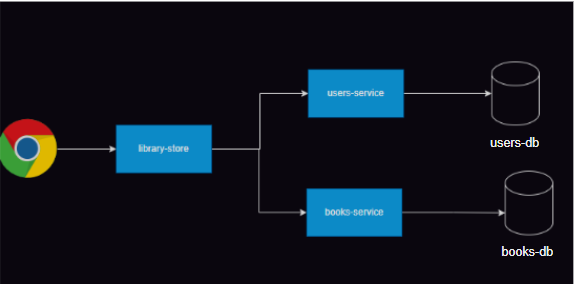

**Example Architecture**

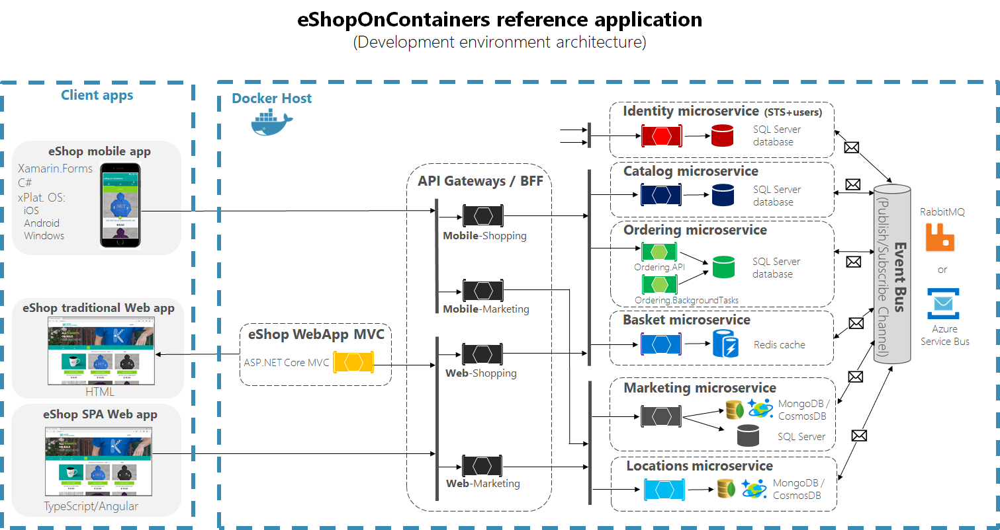

- **For deployment to record the change cause lets use the annotation** [Refer here](https://kubernetes.io/docs/reference/labels-annotations-taints/#change-cause)
- To find the deployment status we use **kubeclt rollout**
```bash
# deployment history
kubectl rollout history deployments <deploment-name>
# to roll back
kubectl rollout undo deployment --to-revision=2
```
- To access the application externally use nodeport or loadbalancer
- To deploy the new version change the tag and change cause annotation

```yaml
apiVersion: apps/v1
kind: Deployment
metadata:
  name: web-deploy
  annotations:
    kubernetes.io/change-cause: "version v1.0"
```


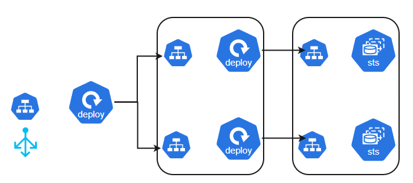

---

* <mark>**Order of Creation :**</mark>
  * **Least Dependent to most dependent**
---
## <mark>**Config Maps and Secrets**</mark>

### <mark>**Config Maps**</mark>

-   [Refer Here](https://kubernetes.io/docs/concepts/configuration/configmap/) for official docs of config maps

```yaml
# config.yaml
---
apiVersion: v1
kind: ConfigMap
metadata:
  name: users-db-config
data:
  POSTGRES_USER: user
  POSTGRES_PASSWORD: password
  POSTGRES_DB: usersdb

# deploy-pod template utilizing env (one key-value's at a time)
template:
  spec:
    containers:
      - name: usersdb
        image: postgres:15-alpine
        env:
          - name: POSTGRES_USER
            valueFrom:
              configMapKeyRef:
                name: users-db-config
                key: POSTGRES_USER


# deploy-pod template utilizing envFrom (all keys-value's at a time)
---
template:
  spec:
    containers:
      - name: usersdb
        image: postgres:15-alpine
        envFrom:
          - configMapRef:
              name: users-db-config
```

-   Config maps gives us flexibility to separate configuration from Pod

#### <u>**Kubernetes ConfigMap Usage Summary**</u>

**ConfigMaps** in Kubernetes allow injecting configuration data into Pods. There are **four ways** to use ConfigMaps:

1. **Inside container commands and args**  
2. **As environment variables**  
3. **As files in a read-only volume**  
4. **Dynamic runtime access using Kubernetes API**  

##### Key Point:
- **Static methods (1, 2, and 3)** require Pod restarts for changes to take effect.
- **Dynamic access (4)** enables real-time configuration updates.  

---

Let me know if you'd like an example for any of these methods! 🚀
### <mark>**Secrets**</mark>

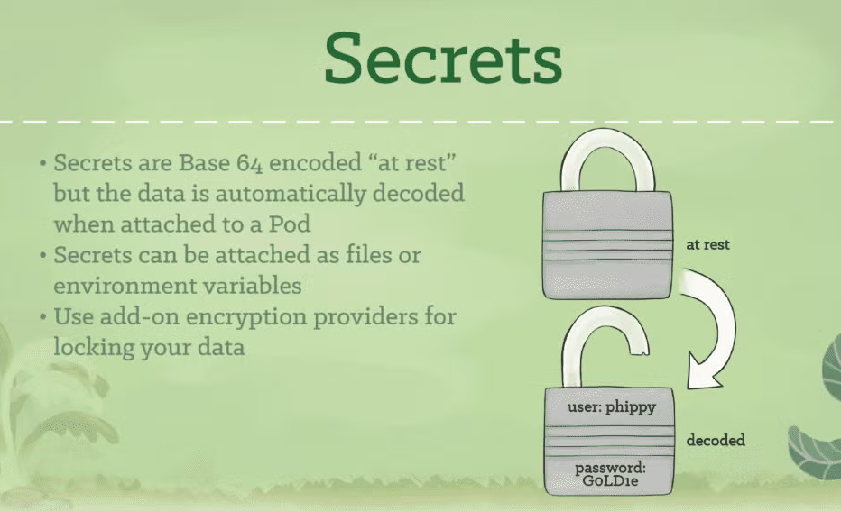

-   The sensitive information is still in plain text, To solve this Secrets for k8s gives an **base64encoding** based approach to store sensitive information
-   [Refer Here](https://kubernetes.io/docs/concepts/configuration/secret/) for official docs of secrets

```yaml
# secrets.yaml
---
apiVersion: v1
kind: Secret
metadata:
  name: users-db-secrets
data:
  POSTGRES_USER: dXNlcg==
  POSTGRES_PASSWORD: cGFzc3dvcmQ=
  POSTGRES_DB: dXNlcnNkYg==

# deploy-pod template utilizing secretRef
---
template:
  spec:
    containers:
      - image: postgres:15-alpine
        name: usersdb
        envFrom:
          - secretRef:
              name: users-db-secrets
```

-   The **production approach** for storing sensitive information will be
    -   Use an **external secrets manager** like azure key vault, aws secrets manager, gcp secrets manager or hashicorp vault
    -   **Use secrets CSI Driver** of a vendor to get the sensitive information into k8s as storage


---
### <mark>**Health Checks or Probes in Kubernetes**</mark>

-   In K8s we have 3 types of Probes (checks)
    -   Liveness Probe:
        -   Determines if the container is running or not
        -   If Probe fails the container is restarted
    -   Readiness Probe
        -   Determines if the application is running or not
        -   If probe fails, this container will not recieve requests from service
    -   Startup Probe
        -   Determines if the container starup is complete or not
        -   If this probe fails no further probes are executed
-   [Refer Here](https://kubernetes.io/docs/tasks/configure-pod-container/configure-liveness-readiness-startup-probes/) for official docs
-   Configuring probes [Refer Here](https://kubernetes.io/docs/tasks/configure-pod-container/configure-liveness-readiness-startup-probes/#configure-probes)

```yaml
spec:
  containers:
    - containerPort: 8000
    livenessProbe:
      initialDelaySeconds: 3
      periodSeconds: 10
      successThreshold: 1
      failureThreshold: 3
      tcpSocket:
        port: 8000
    readinessProbe:
      initialDelaySeconds: 5
      periodSeconds: 10
      successThreshold: 1
      failureThreshold: 3
      httpGet:
        path: /docs
        port: 8000
    startupProbe:
      initialDelaySeconds: 2
      periodSeconds: 10
      successThreshold: 1
      failureThreshold: 3
      exec:
        command:
          - /bin/sh
          - -c
          - ps aux | grep uvicorn
```
---
### <mark>**Connecting from pod to the service running in a different name space**</mark>

```bash
# Direct DNS Access
<service-name>.<namespace>.svc.cluster.local
# curl http://my-svc.dev
```
---
## <mark>**Kubernetes Storage**</mark>

* Container Storage Interface (CSI) is a storage interface for k8s
* List of CSI drivers [Refer here](https://kubernetes-csi.github.io/docs/drivers.html)

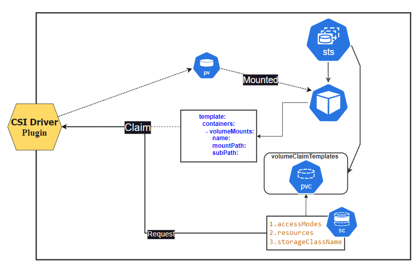

-   [Refer Here](https://kubernetes.io/docs/concepts/storage/persistent-volumes/) for official docs of PVs (persitent volume)
-   [Refer Here](https://kubernetes.io/docs/concepts/storage/storage-classes/) for official docs of Storage Classes
- `kubectl get sc` to get the available storage classes
-   Access Modes
    -   RWO – ReadWriteOnce (Suitable for block storages like EBS, Azure Disk, Persistent Disk)
    -   ROX – ReadOnlyMany (Any disk)
    -   RWX – ReadWriteMany (Typically fileshares or blob storages)
    -   RWOP – ReadWriteOncePod (Suitable for block storages like EBS, Azure Disk, Persistent Disk)
-   [Refer Here](https://learn.microsoft.com/en-us/azure/aks/azure-csi-disk-storage-provision) for using Azure Disk as PV

### Lets create a mysql Pod where we create a persitent volume dynamically

```yaml
apiVersion: v1
kind: Pod
metadata:
  name: mysql
  labels:
    name: mysql
spec:
  containers:
    - name: mysql
      image: mysql:9
      # skipped env, ports, resorces columns
      volumeMounts:
        - name: libdb
          mountPath: /var/lib/mysql
  volumes:
    - name: libdb
      persistentVolumeClaim:
        claimName: mysql-pvc
---
apiVersion: v1
kind: PersistentVolumeClaim
metadata:
  name: mysql-pvc
spec:
  accessModes:
    - ReadWriteOnce
  storageClassName: managed
  resources:
    requests:
      storage: 1Gi
```
-   Exercise: Try running mongodb with pvc and postgres with pvc

---
---

### <mark>**Necessity for database cluster**</mark>

-   To have **High Availability** we run database in multiple servers in the case of k8s multiple pods
-   IN db cluster we have multiple servers and each server will have its own storage
-   So we need to create pods and each pod should have its own persistent volume
-   challenge to create cluster with deployments:
    -   managing multiple PVs
    -   pod names are not predictable: database clusters generally will have predictable endpoints (read endpoint, write endpoint)
-   So we need a way to create
    -   multiple pods and pvs
    -   pod names should be predicatable
-   all of the above are acheived with stateful sets

---

## <mark>**Statefulset**</mark>
-   [Refer Here](https://kubernetes.io/docs/concepts/workloads/controllers/statefulset/) for official docs
-   Stateful sets create multiple pods with a predicatable name in a sequential order (0 to n)
-   Rolling updates will be performed in a reverse order (n-0)
-   Each Pod will raise a PVC to get a PV [refer **Kubernetes Storage** for pvc]
-   Generally we will have a headless service to access specific pod
-   Statefulsets are widely used to create database clusters and any application with state.
-   Since we acces pod using headless service the libarary application will have a DATABASE URI changed to \
    `postgresql://user:password@<pod-name>.<service-name>:5432/<postgres-db>`
-   [Refer Here](https://github.com/mydummyrepo/library_application/blob/main/users_db.yml) for the changes done to move away from replicaset to stateful set for database pods in library application.
-   For executions watch classroom recording

___
---
## <mark>**Lens**</mark>

-   [Refer Here](https://k8slens.dev/) for kubernetes lens IDE
  
---
---
## <mark>**Scheduling pods on Specific Nodes**</mark>

[Refer here for Official docs](https://kubernetes.io/docs/concepts/scheduling-eviction/assign-pod-node/) on Assigning Pods to Specific Nodes

* In Kubernetes, scheduling pods on nodes is essential to ensure resources are utilized efficiently and application requirements are met.
* Here are key techniques and strategies used for scheduling pods:

### 1. **Node Selector**

- The simplest method to control pod scheduling to specific nodes.
- Define **`nodeSelector`** in the pod specification to match required node labels.
- Only nodes with the specified labels will be eligible to host the pod.

```yaml
spec:
  nodeSelector:
    disktype: ssd
``` 

This ensures the pod is scheduled only on nodes labeled with `disktype: ssd`.
---
### 2. **Affinity and anti-affinity**

#### **Node affinity and Anti-Affinity**
-   **Node Affinity**: A more flexible and expressive method than `nodeSelector`. Allows specifying rules for preferred and required node selection.
    -   _Required (hard constraint)_: The pod will only be scheduled if nodes match.
    -   _Preferred (soft constraint)_: The scheduler tries to match but may skip if unavailable.
-   **Anti-Affinity**: Ensures that certain pods are not placed on the same node or close to others. Useful for high availability.

```yaml
spec:
  affinity:
    nodeAffinity:
      requiredDuringSchedulingIgnoredDuringExecution:
        nodeSelectorTerms:
          - matchExpressions:
              - key: disktype
                operator: In
                values:
                  - ssd
```
#### **Pod Affinity and Anti-Affinity**

- **Pod Affinity**: Ensures pods are scheduled together on nodes for better performance or resource sharing.
- **Pod Anti-Affinity**: Spreads pods across nodes to prevent resource contention or failure impact.

```yaml
affinity:
  podAffinity:
    requiredDuringSchedulingIgnoredDuringExecution:
      - labelSelector:
          matchLabels:
            app: frontend
        topologyKey: "kubernetes.io/hostname"
```
* Common Topology Keys:
  * Some commonly used topology keys include:
  * <u>topology.kubernetes.io/zone</u>: This key represents different availability zones within a cloud provider. Pods can be scheduled to ensure they are in the same zone or spread across different zones.
  * <u>kubernetes.io/hostname</u>: This key refers to individual node names. It can be used to ensure that certain pods are co-located on the same node or, conversely, not placed on the same node.
---

### 3. **Taints and Tolerations**

- **Taints**: Repel certain pods by applying constraints on nodes.
- **Tolerations**: Allow pods to tolerate taints, enabling scheduling on tainted nodes.
- Commonly used for dedicated or isolated workloads.

#### Example of Adding Taints

To add a taint to a node, you can use the following command:

```bash
kubectl taint nodes <node-name> key=value:NoSchedule
```
#### Example of Adding Tolerations

```yaml
tolerations:
  - key: "key"
    operator: "Equal"
    value: "value"
    effect: "NoSchedule"
```
#### Built-in Taints

Kubernetes includes several built-in taints that manage node conditions automatically:

- `node.kubernetes.io/not-ready`: Applied when the node is not in a ready state.
- `node.kubernetes.io/unreachable`: Applied when the node is unreachable from the controller.
- `node.kubernetes.io/memory-pressure`: Indicates that the node is experiencing memory pressure.
- `node.kubernetes.io/disk-pressure`: Indicates disk pressure on the node.
---

### 4. **Resource Requests and Limits**

- Define CPU and memory needs for pods to prevent overloading nodes.
- Requests ensure minimal resource availability.
- Limits cap resource usage per pod.

```yaml
resources:
  requests:
    memory: "64Mi"
    cpu: "250m"
  limits:
    memory: "128Mi"
    cpu: "500m"
```

---

### 5. **Priority and Preemption**

- Prioritize critical applications by allowing higher-priority pods to preempt lower-priority ones.
- Managed using **priority classes**, ensuring essential apps are scheduled under resource constraints.

```yaml
# Define a PriorityClass
apiVersion: scheduling.k8s.io/v1
kind: PriorityClass
metadata:
  name: high-priority
value: 1000000 # higher number higher value
globalDefault: false
description: "This priority class is for critical applications."
---
# Deployment using the high-priority class

    spec:
      priorityClassName: high-priority  # Use the defined priority class
      containers:
        - name: app-container
          image: your-image:latest
          ports:
            - containerPort: 80
```
---

### 6. **Topology Spread Constraints**

- Distribute pods evenly across nodes to reduce single points of failure.
- Ensures fault tolerance and optimal use of availability zones.

```yaml
# This example shows how to distribute pods evenly across availability zones using topology spread constraints.
topologySpreadConstraints:
  - maxSkew: 1  # Allow at most one pod difference between zones.
    topologyKey: "topology.kubernetes.io/zone"  # Spread across zones.
    whenUnsatisfiable: DoNotSchedule  # Don't schedule if constraints can't be met.
    labelSelector:
      matchLabels:
        app: frontend  # Match the frontend application pods.
```

---

### 7. **Custom Schedulers**

- Use custom Kubernetes schedulers for specific workload requirements (e.g., data locality or latency optimization).

---
---
### <mark>**Cordon and Drain in Kubernetes**</mark>

**Cordon** and **Drain** are administrative commands for managing node workloads during maintenance, upgrades, or decommissioning.

---

### **Cordon**

- **Purpose**: Prevents new pods from being scheduled on a node while keeping existing pods running.
- Marks the node as **unschedulable** without disrupting workloads.

**Command**:  
```bash
kubectl cordon <node-name>
```
---

### **Drain**

- **Purpose**: Safely evicts all pods from a node.
- Ensures workloads are shifted to other nodes if resources are available.
- Respects **PodDisruptionBudgets** to avoid disrupting critical services.
- Does not affect DaemonSet pods (they are skipped).

**Command**:  
```bash
kubectl drain <node-name> --ignore-daemonsets --delete-emptydir-data
```

**Flags**:
- `--ignore-daemonsets`: Ignores DaemonSet-managed pods during eviction.
- `--delete-emptydir-data`: Deletes pods using ephemeral `emptyDir` volumes.

---

### **Workflow: Cordon and Drain**

1. **Cordon** the node to stop new pods from being scheduled:
   ```bash
   kubectl cordon <node-name>
   ```
2. **Drain** the node to evict running pods safely:
   ```bash
   kubectl drain <node-name> --ignore-daemonsets --delete-emptydir-data
   ```
3. Perform necessary maintenance or upgrades.
4. **Uncordon** the node to make it schedulable again:
   ```bash
   kubectl uncordon <node-name>
   ```

---
---

## <mark>**Administrative Activity: Upgrading K8s Clusters**</mark>

### **Self-Hosted Clusters**

1. Review release notes for new version changes.
2. Backup etcd cluster and persistent volumes.
3. **Cordon** the node to prevent scheduling.
4. **Drain** the node to evict pods safely.
5. Upgrade using Linux commands.
6. **Uncordon** the node to resume scheduling.


### **Managed Clusters**

- Follow cloud provider documentation for upgrades.

---
---
## <mark>**Ingress and Ingress Controllers**</mark>

- Official Docs: [Ingress](https://kubernetes.io/docs/concepts/services-networking/ingress/) | [Ingress Controllers](https://kubernetes.io/docs/concepts/services-networking/ingress-controllers/)

#### **Ingress**

- **Purpose**: Manages HTTP(S) traffic into the cluster, acting as an entry point to expose services. It supports routing, TLS termination, and advanced traffic rules beyond traditional **NodePort** or **LoadBalancer** services.

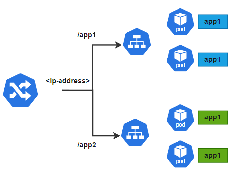

**Key Features**:
1. **Path-based Routing**: Directs traffic to services based on URL paths.  
2. **Host-based Routing**: Routes traffic based on domain names.  
3. **TLS Termination**: Simplifies HTTPS communication by offloading encryption.  
4. **Backend Services**: Connects to and distributes traffic among services.  


#### **Ingress Controllers**

- **Purpose**: Implements the Ingress resource, routing traffic based on its rules. Kubernetes does not include a default Ingress Controller—you need to deploy one.  

To install the NGINX Ingress Controller in your Kubernetes cluster, you can use the following command:

```bash
kubectl apply -f https://raw.githubusercontent.com/kubernetes/ingress-nginx/main/deploy/static/provider/cloud/deploy.yaml
```

**Common Controllers**:  
1. **NGINX** (most widely used)  
2. **Traefik**  
3. **HAProxy**  
4. **AWS ALB Ingress** (for AWS-specific workloads)  
5. **Istio Gateway** (part of Istio service mesh)  


#### **Annotations for Custom Behavior**

**Examples**:
- **Rewrite URLs**:  
  ```yaml
  nginx.ingress.kubernetes.io/rewrite-target: /
  ```
- **Enforce HTTPS**:  
  ```yaml
  nginx.ingress.kubernetes.io/force-ssl-redirect: "true"
  ```
- **Set Load Balancer Limits**:  
  ```yaml
  nginx.ingress.kubernetes.io/proxy-body-size: 10m
  ```
---
To get the ingress class
```bash
kubectl get ingressclasses
```
**Example file**:
```yaml
apiVersion: networking.k8s.io/v1
kind: Ingress
metadata:
  name: app-ingress
spec:
  ingressClassName: nginx     # ingress class
  rules:
    - http:
        paths:
          - path: /app1
            pathType: Prefix
            backend:
              service:
                name: app1-service
                port:
                  number: 80
          - path: /app2
            pathType: Prefix
            backend:
              service:
                name: app2-service
                port:
                  number: 80
```
---
---

## <mark>Kubernetes Metrics Service</mark>

* The **Kubernetes Metrics Server** is a key component that collects and aggregates resource metrics (CPU and memory) from nodes and pods in a Kubernetes cluster.
* It primarily supports the Horizontal Pod Autoscaler (HPA) and Vertical Pod Autoscaler (VPA).
* [Refer Here](https://kubernetes-sigs.github.io/metrics-server/) for metrics-server docs.

### Key Features
- **Resource Metrics Collection**: Gathers metrics from Kubelets and exposes them via the Metrics API.
- **Autoscaling Support**: Provides metrics for HPA and VPA, enabling dynamic scaling of workloads.
- **Lightweight**: Consumes minimal resources, making it efficient for large clusters.
- **Easy Deployment**: Can be deployed simply as a single instance in most clusters.

### Use Cases
- **Horizontal Autoscaling**: Adjusts pod replicas based on CPU/memory usage.
- **Vertical Autoscaling**: Suggests optimal resource requests for containers.
- **Monitoring**: Allows users to retrieve metrics using `kubectl top`.

### Limitations
- **Not Comprehensive**: Does not serve as a general-purpose monitoring solution due to Limited Resource Tracking.
  - integration with tools like Prometheus is recommended for detailed monitoring.

### Implementation
To deploy:
1. Install using `kubectl` or Helm:
   ```bash
   kubectl apply -f https://github.com/kubernetes-sigs/metrics-server/releases/latest/download/components.yaml
   ```
2. Verify deployment with:
   ```bash
   kubectl get pods --all-namespaces | grep metrics-server
   ```
3. Access metrics via the Kubernetes API or `kubectl top` \
   **`kubectl top pods`**

#### **Note**
- To enable monitoring for **managed clusters**, we have to follow cloud-specific approaches.
---

### Horizontal Pod Autoscaler

- Automatically adjusts the number of pod replicas in a Kubernetes deployment based on observed CPU, memory, or custom metrics.
- **[Refer Here](https://kubernetes.io/docs/tasks/run-application/horizontal-pod-autoscale/)** for Horizontal Pod Autoscaler documentation.

```yaml
apiVersion: autoscaling/v2
kind: HorizontalPodAutoscaler
metadata:
  name: hpa-demo
spec:
  maxReplicas: 10
  minReplicas: 1
  scaleTargetRef:
    apiVersion: apps/v1   # Specify the API version of the target resource
    kind: Deployment       # Specify the kind of resource being targeted (e.g., Deployment, StatefulSet)
    name: web-app         # Name of the deployment to scale
  behavior:               # Default 
    scaleUp:
      stabilizationWindowSeconds: 60
      policies:
        - type: Pods       # Type of scaling policy (Pods or Percent)
          value: 1        # Number of pods to add per scaling event
          periodSeconds: 60
    scaleDown:
      stabilizationWindowSeconds: 60
      policies:
        - type: Percent    # Type of scaling policy (Pods or Percent)
          value: 10       # Percentage of pods to remove per scaling event
          periodSeconds: 60
  metrics:
    - resource:
        name: cpu         # Resource metric to monitor (cpu, memory)
        target:
          type: Utilization
          averageUtilization: 70   # Target average CPU utilization percentage

```
### Vertical Pod Autoscaler

- Automatically adjusts the resource requests and limits for containers in a pod based on historical usage data to ensure optimal resource allocation.
- **VPA** can operate in different **modes** (Off Mode, Initial Mode, Auto mode, Recreate Mode), with the **Off mode** being primarily used for providing **resource recommendations** without automatically applying them.
- **[Refer Here](https://kubernetes.io/docs/concepts/workloads/autoscaling/)** for official documentation on Vertical Pod Autoscaler.

```yaml
apiVersion: autoscaling.k8s.io/v1
kind: VerticalPodAutoscaler
metadata:
  name: vpa-demo
spec:
  targetRef:
    apiVersion: apps/v1
    kind: Deployment
    name: web-app
  updatePolicy:
    updateMode: "Off"  # Set to Off to only gather recommendations
  resourcePolicy:
    containerPolicies:
      - containerName: "web-app-container"
        minAllowed:
          cpu: "100m"       # Minimum CPU allocation
          memory: "128Mi"   # Minimum memory allocation
        maxAllowed:
          cpu: "1"          # Maximum CPU allocation
          memory: "1Gi"     # Maximum memory allocation

```
### Node Autoscaling (for Managed K8s Clusters)

- Node autoscaling in Kubernetes refers to the automatic adjustment of the number of nodes in a cluster based on the demands of workloads.
- **[Refer Here](https://kubernetes.io/docs/concepts/cluster-administration/cluster-autoscaling/)** for official documentation

---
---
## <mark>**Network Policy**</mark>

- **[Refer Here](https://kubernetes.io/docs/concepts/services-networking/network-policies/)** for Network Policy documentation.
  
### Overview of Network Policies

* Network Policies control traffic flow at the IP address or port level (OSI layer 3 or 4). 
* They specify rules for traffic flow within your cluster and between Pods and the outside world.
* Ensure your cluster uses a network plugin that supports NetworkPolicy enforcement.

### Example Network Policy YAML

```yaml
apiVersion: networking.k8s.io/v1
kind: NetworkPolicy
metadata:
  name: users-db-np
spec:
  podSelector:
    matchLabels:
      db: users
  policyTypes:
    - Ingress
  ingress:
    - from:
        - podSelector:
            matchLabels:
              app: users
```
**Example NetworkPolicy to Deny All Traffic from Other Namespaces**

```yaml
apiVersion: networking.k8s.io/v1
kind: NetworkPolicy
metadata:
  name: deny-from-other-namespaces
  namespace: default  # Specify the namespace where this policy applies
spec:
  podSelector: {}  # Select all pods in the specified namespace
  policyTypes:
    - Ingress  # This policy applies to incoming traffic
  ingress:
    - from:
        - podSelector: {}  # Allow traffic from all pods in the same namespace

```
**Labels for Network policy (podSelector)**


---
---

## <mark>**Kubernetes Authentication and Authorization**</mark>

<mark>**The kubeconfig file contains**:</mark>

* clusters information: Foreach cluster we have **url of apiServer** and **cluster certificate** (for tls auth)
* One **.kube config file** can have **multiple clusters**
* For Each Cluster there will be certificate and url

**Kube Config File Certificates and Keys**

1. **Server Certificate and Key**:
   - **Purpose**: Used by the Kubernetes API server to establish secure TLS connections with clients.
   - **Location**: Typically stored in `/etc/kubernetes/pki`.

2. **Client Certificate and Key**:
   - **Purpose**: Used by clients (like `kubectl`) to authenticate themselves to the Kubernetes API server.
   - **Location**: Paths specified in the `kubeconfig` file, e.g., `--client-certificate` and `--client-key`.


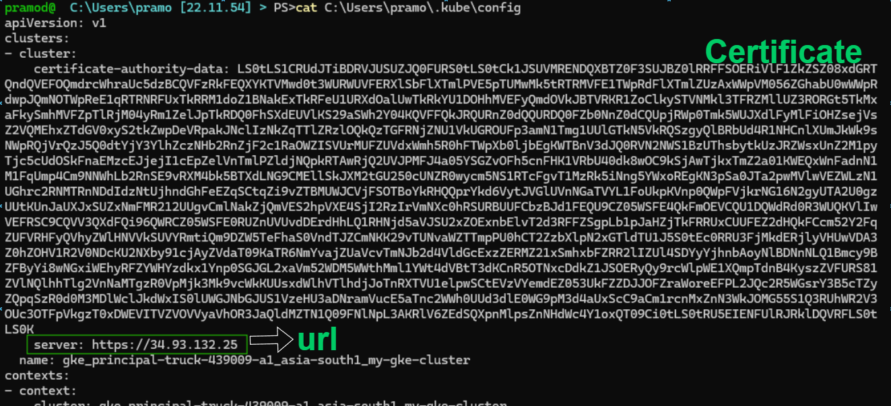

* context: which cluster and which namespace is default
* we can switch context
  * For more detailed information and examples, you can refer to the following official documentation:
    - [Kubernetes Documentation on Configuring Access to Multiple Clusters](https://kubernetes.io/docs/tasks/access-application-cluster/configure-access-multiple-clusters/)
    - [Kubectl Config Set-Context Command](https://kubernetes.io/docs/reference/kubectl/generated/kubectl_config/kubectl_config_set-context/)
    - [Spacelift Blog on Kubectl Config Set-Context](https://spacelift.io/blog/kubectl-set-context)
  
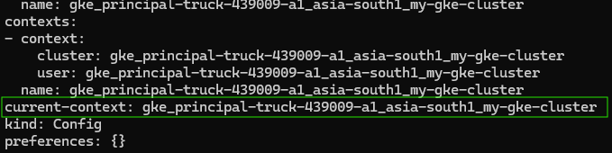

**users**:

##### User Certificate and Key
1. **User Certificate and Key**:
   - **Purpose**: Used by individual users to authenticate themselves to the Kubernetes cluster.
   - **Location**: Paths specified in the `kubeconfig` file under the user entry.
   - **Purpose**: Used by the Kubernetes API server to establish secure TLS connections with clients.
   - **Location**: Typically stored in `/etc/kubernetes/pki`.

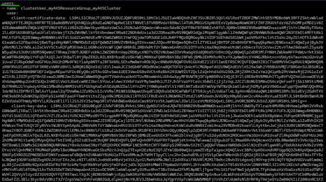

---
### <mark>**Overview of Authentication and Authorization**</mark>

**Overview**

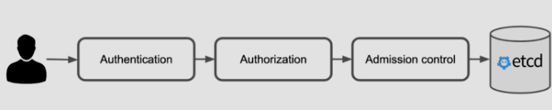

```
**Checking User Identity (Authentication)** --> **Permission to Activity (Authorization)** --> **Validate Activity Against Kubernetes Policies (Admission Control)**  --> **Store State in etcd (Persistence)**
```

### <mark>**Authentication**</mark>

- Kubernetes does not have an inbuilt identity system; authentication is pluggable.
- External identity providers include:
  - Azure AD
  - AWS IAM
  - OIDC
  - Active Directory (AD)

### <mark>**Authorization**</mark>

- Authorization is also pluggable, with RBAC (Role-Based Access Control) being the most widely adopted method.
    -   Role:
        -   You define the permission at **namespace level**
    -   RoleBinding
        -   Attaching a Role to a user/serviceaccount
    -   ClusterRole:
        -   You define the permission at **cluster level**
    -   ClusterRoleBinding
        -   Attaching a clusterrole to a user/serviceaccount

#### 1. <u>**User-Role Definitions**</u>:

- **Role**: Defines permission levels at the namespace level.
  
```yaml
apiVersion: rbac.authorization.k8s.io/v1
kind: Role
metadata:
  namespace: default # Specify the namespace
  name: readonly
rules:
  - apiGroups: ["*"]  # a way to group related API objects together in k8s
    resources: ["*"]
    verbs: ["get", "list", "watch"]
```

- **RoleBinding**: Attaches a Role to a user/service account.

```yaml
apiVersion: rbac.authorization.k8s.io/v1
kind: RoleBinding
metadata:
  name: readonly-user-binding
  namespace: default # Specify the namespace
subjects:
  - kind: User # or Group if using groups
    name: user1aksadmin@yourdomain.com # The user's email
    apiGroup: rbac.authorization.k8s.io
roleRef:
  kind: Role
  name: readonly
  apiGroup: rbac.authorization.k8s.io
```

#### 2. <u>**Service Accounts**</u>
* Users are not part of k8s, but service accounts are 
*  Every Pod is assigned a Service Account unless specified otherwise(which is a security risk). \
  `automountServiceAccountToken: false`

**Purpose**: 
- To provide an identity for processes running in Pods to interact with the Kubernetes API.
- To manage access control and permissions for those processes.

**Types of Service Accounts**:
1. **Default Service Account**: Automatically created in every namespace and used if no other service account is specified.
2. **Custom Service Accounts**: Created by users to grant specific permissions.

### Creating and Using Service Accounts

1. **Create a Service Account**:
   ```yaml
   apiVersion: v1
   kind: ServiceAccount
   metadata:
     name: my-service-account
     namespace: default
   ```
   - Save this YAML to a file (e.g., `service-account.yaml`) and apply it:
     ```bash
     kubectl apply -f service-account.yaml
     ```

2. **Assign Service Account to a Pod**:
   ```yaml
   apiVersion: v1
   kind: Pod
   metadata:
     name: my-pod
   spec:
     serviceAccountName: my-service-account
     containers:
     - name: my-container
       image: my-image
   ```
   - Save this YAML to a file (e.g., `pod-with-service-account.yaml`) and apply it:
     ```bash
     kubectl apply -f pod-with-service-account.yaml
     ```

### Managing Permissions with Role-Based Access Control (RBAC)

1. **Create a Role**:
   ```yaml
   apiVersion: rbac.authorization.k8s.io/v1
   kind: Role
   metadata:
     namespace: default
     name: pod-reader
   rules:
   - apiGroups: [""]
     resources: ["pods"]
     verbs: ["get", "list", "watch"]
   ```

2. **Bind the Role to a Service Account**:
   ```yaml
   apiVersion: rbac.authorization.k8s.io/v1
   kind: RoleBinding
   metadata:
     name: read-pods
     namespace: default
   subjects:
   - kind: ServiceAccount
     name: my-service-account
     namespace: default
   roleRef:
     kind: Role
     name: pod-reader
     apiGroup: rbac.authorization.k8s.io
   ```
   - Save these YAMLs and apply them using:
     ```bash
     kubectl apply -f role.yaml
     kubectl apply -f rolebinding.yaml
     ```

### <mark>**Admission Control**</mark>

#### Mutation-Based Admission Control
- **Purpose**: Mutate or alter the requests before they are persisted.
- **Examples**: Add default values, inject sidecars, modify resource requests.

#### Validation-Based Admission Control
- **Purpose**: Validate the requests to ensure they comply with policies.
- **Examples**: Enforce resource quotas, pod security policies, deny specific configurations.
---

#### **`kubectl auth can-i` command**

The `kubectl auth can-i` command is a helpful tool to check whether a user or service account has permission to perform a specific action in your Kubernetes cluster. Here's how you can use it:

### Usage

To check if you have permission to perform an action:
```bash
kubectl auth can-i <verb> <resource>
```

For example,

1. **Check if you can create deployments**:
   ```bash
   kubectl auth can-i create deployments
   ```
---
---
## <mark>**Managing Kubernetes Manifests and Configurations**</mark>

- Kubernetes manifests are static, requiring manual updates and version control.
- For better reusability:
  - **Kustomize**: Native Kubernetes tool for overlays.
  - **Helm**: Kubernetes package manager for templating and reuse.

---
